# ERD — Database Foundation (Phase 02A)

Source of truth: `database/schema.prisma`. This document is a human-readable view of that
schema — if the two ever disagree, the schema file wins; update this document to match it,
not the other way around.

Scope: the entities required by `02-foundation/01_DATABASE_FOUNDATION.md` (plus the two
infra additions justified in `docs/database/DATA_DICTIONARY.md`), extended by Phase 07's
Profile Development slice (section 4 below: AssessmentCriterion, RoadmapMilestoneDependency,
AcademicRecord, TestRecord, Competition, ResearchProject, Activity, WritingArtifact,
WritingVersion, LetterOfRecommendation) and Phase 07's Documents domain (section 6:
Document, DocumentAccess), and by Phase 08's full build-out of the Admission domain
(section 5: UniversityChoice, ApplicationChecklist, Offer, ScholarshipApplication —
formerly foundation-only stubs, now fully implemented), by Phase 09's Visa domain
(section 12: Visa, VisaChecklistTemplate, VisaChecklistItem, Enrollment), by Phase 10's
full build-out of the Partners domain (section 8: PartnerStudentLink, CommissionRule,
CommissionTransaction — new; Partner, PartnerProgram, PartnerDocument — formerly
foundation-only stubs, now fully implemented), and by Phase 11's Student/Parent Portal
(section 10: `ParentInvitation` — new; `StudentContact` extended with
`portalStatus`/`revokedAt`/`revokedById`, `Task` extended with `visibleToStudent` — section
3). Portal introduced no new business-domain entity beyond `ParentInvitation` — every
Portal capability is a permission-gated read/action layer over existing tables. Phase 12
(12-platform/*.md) completes the Documents domain's real storage/scan/versioning pipeline
(section 6: `Document` extended with `originalFilename`/`scanStatus`/`previousVersionId`),
adds the external-data-sync columns to Admission master data (section 5:
`sourceUrl`/`externalId`/`retrievedAt`/`syncStatus` on University/Program/
ScholarshipMaster), and adds two cross-cutting infra tables (section 11: `BackgroundJob`,
`IncomingWebhookEvent`) — no new business-domain entity. No entity remains deferred to a
later phase in this ERD as of Phase 12 — see `docs/architecture/DOMAIN_MAP.md` for the full
domain ownership map.

## 1. Domain overview

```mermaid
erDiagram
    IDENTITY_DOMAIN {
        string note "User, Role, Permission, RolePermission, AuditLog"
    }
    CRM_DOMAIN {
        string note "Lead"
    }
    CASE_MGMT_DOMAIN {
        string note "Student, StudentContact, Case, CaseMember, Task, TaskDependency, TaskTemplate"
    }
    COUNSELING_DOMAIN {
        string note "Assessment, AssessmentCriterion, Roadmap, RoadmapMilestone, RoadmapMilestoneDependency, AcademicRecord, TestRecord, Competition, ResearchProject, Activity, WritingArtifact, WritingVersion, LetterOfRecommendation (Phase 07)"
    }
    ADMISSION_DOMAIN {
        string note "University, Program, ScholarshipMaster, UniversityChoice, Application, ApplicationChecklist, Offer, ScholarshipApplication (Phase 08)"
    }
    VISA_DOMAIN {
        string note "Visa, VisaChecklistTemplate, VisaChecklistItem, Enrollment (Phase 09)"
    }
    COMMERCIAL_DOMAIN {
        string note "ContractTemplate, Contract, ContractReviewLink, ContractAmendment, Payment"
    }
    PARTNERS_DOMAIN {
        string note "Partner, PartnerProgram, PartnerDocument, PartnerStudentLink, CommissionRule, CommissionTransaction (Phase 10)"
    }
    DOCUMENTS_DOMAIN {
        string note "Document, DocumentAccess"
    }
    NOTIFICATIONS_DOMAIN {
        string note "Notification, Comment, Approval"
    }

    CRM_DOMAIN ||--o{ CASE_MGMT_DOMAIN : "Lead.convertedStudentId -> Student"
    CASE_MGMT_DOMAIN ||--o{ COMMERCIAL_DOMAIN : "Case.contractId -> Contract"
    CASE_MGMT_DOMAIN ||--o{ COUNSELING_DOMAIN : "case_id FK"
    CASE_MGMT_DOMAIN ||--o{ ADMISSION_DOMAIN : "student_id / case_id FK"
    COUNSELING_DOMAIN ||--o{ ADMISSION_DOMAIN : "assessment backs roadmap; profile informs application"
    ADMISSION_DOMAIN ||--o{ PARTNERS_DOMAIN : "Program.id <- PartnerProgram.programId (nullable, real FK, Phase 10)"
    COMMERCIAL_DOMAIN ||--o{ CASE_MGMT_DOMAIN : "Contract.studentId -> Student"
    IDENTITY_DOMAIN ||--o{ CASE_MGMT_DOMAIN : "owner_id / actor_id FK everywhere"
    DOCUMENTS_DOMAIN ||--o{ COMMERCIAL_DOMAIN : "signedDocumentId reference (string, ASM-02)"
    DOCUMENTS_DOMAIN ||--o{ COUNSELING_DOMAIN : "evidenceDocumentId / documentId FK (real FK, ASM-24 — Phase 07)"
    DOCUMENTS_DOMAIN ||--o{ ADMISSION_DOMAIN : "evidenceDocumentId / documentId FK (real FK, Phase 08)"
    COUNSELING_DOMAIN ||--o{ ADMISSION_DOMAIN : "WritingArtifact.essayArtifactId <- ScholarshipApplication (Phase 08 reuse)"
    CASE_MGMT_DOMAIN ||--o{ COUNSELING_DOMAIN : "Task.milestoneId -> RoadmapMilestone (Phase 07 Task Engine reuse)"
    CASE_MGMT_DOMAIN ||--o{ ADMISSION_DOMAIN : "Task auto-generation: APPLICATION_SUBMITTED/SCHOLARSHIP_AWARDED (Phase 08)"
    NOTIFICATIONS_DOMAIN ||--o{ IDENTITY_DOMAIN : "recipient_id -> User"
    CASE_MGMT_DOMAIN ||--o{ VISA_DOMAIN : "student_id / case_id FK (Phase 09)"
    ADMISSION_DOMAIN ||--o{ VISA_DOMAIN : "Offer.id <- Visa.offerId (nullable) / Enrollment.offerId (required)"
    DOCUMENTS_DOMAIN ||--o{ VISA_DOMAIN : "evidenceDocumentId / resultEvidenceDocumentId / documentId FK (real FK)"
    CASE_MGMT_DOMAIN ||--o{ VISA_DOMAIN : "Task auto-generation: VISA_GRANTED (Phase 09)"
    VISA_DOMAIN ||--o{ CASE_MGMT_DOMAIN : "VisaStatusService exposes Case-closure preconditions (Phase 09)"
    COMMERCIAL_DOMAIN ||--o{ CASE_MGMT_DOMAIN : "PaymentsService.hasOutstandingDebtForCase exposes Case-closure precondition (Phase 09)"
    CASE_MGMT_DOMAIN ||--o{ PARTNERS_DOMAIN : "student_id / case_id / application_id FK (PartnerStudentLink, CommissionTransaction — Phase 10)"
    DOCUMENTS_DOMAIN ||--o{ PARTNERS_DOMAIN : "documentId FK (real FK, PartnerDocument — Phase 10)"
    COMMERCIAL_DOMAIN ||--o{ PARTNERS_DOMAIN : "CommissionTransaction.sourceType='Contract'|'Payment' (polymorphic, live-read at calculate time — Phase 10)"
```

Table ownership follows `docs/architecture/DOMAIN_MAP.md` exactly — one owning domain per
table, everyone else references by foreign key.

## 2. Identity domain

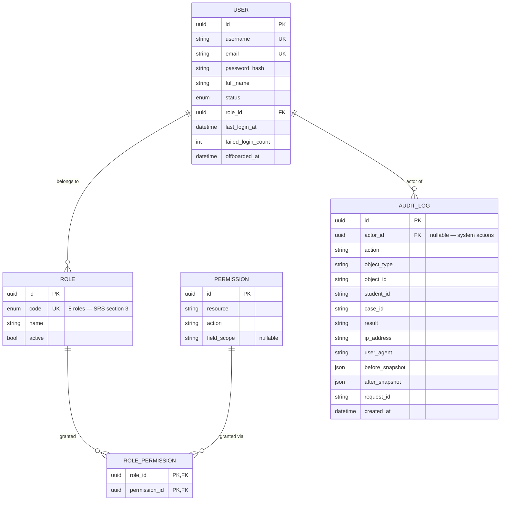

`AuditLog` has no `updated_at` and no soft-delete column on purpose — it is append-only
(Hard Rule #5, NFR-SEC-05); the API never exposes an update/delete path for it.

## 3. CRM + Case Management domains (extended by Phase 04 — Core CRM)

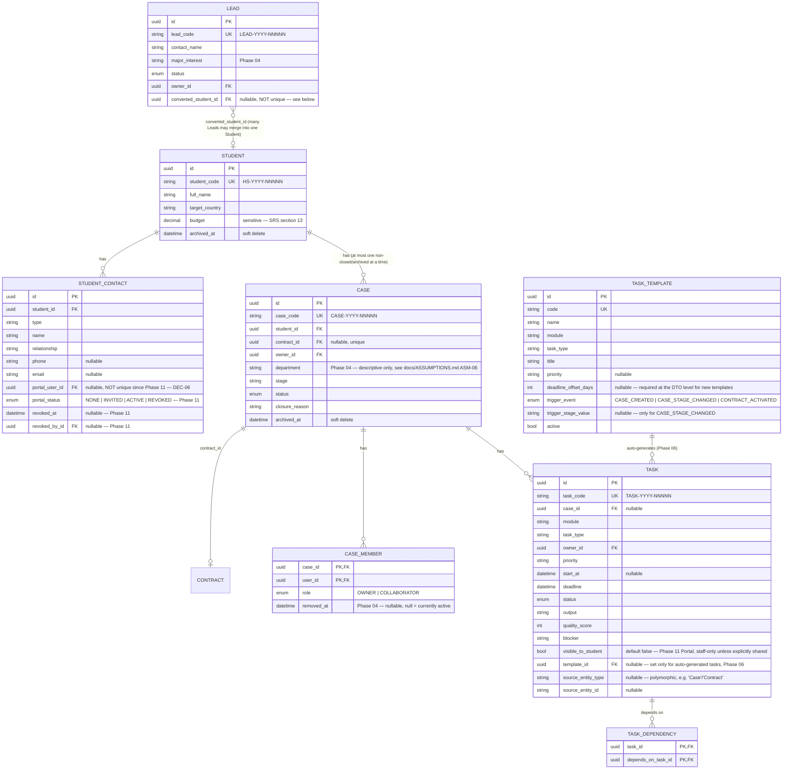

Note: `Task.status` has no `OVERDUE` enum value — SRS section 9 explicitly says Overdue is
a **derived** state (computed from `deadline < now() AND status NOT IN (DONE, CANCELLED)`),
not something staff sets directly. Computing and surfacing it is a query/reporting concern
for a later phase, not a stored column here — implemented in Phase 06 as
`TasksService.isOverdue`, the one shared function every read path (list filter, computed
response field) calls, deliberately never written back to `status` (unlike
`PaymentStatus.OVERDUE`, which IS a stored, lazily-synced status — see section 7's Payment
note). This same derived-state pattern is why Case closure checks a live `Task` count
rather than a stored "is closable" flag — `CasesService.close()`; as of Phase 06, that
count now includes any auto-generated tasks too, since they're ordinary `Task` rows with no
special exemption from the open-task closure guard.

`(template_id, source_entity_type, source_entity_id)` is unique on `Task` — the idempotency
guarantee for auto-generation (06-operations/01_TASK.md "task generation phải idempotent");
Postgres treats a row with any NULL among those three columns as distinct from every other
such row, so ordinary manually-created tasks (all three NULL) are unaffected. See
`docs/ASSUMPTIONS.md` ASM-19 for what "idempotent" means here across repeat real-world
stage re-entries, not just literal request retries.

**`Lead.converted_student_id` is deliberately NOT unique** (fixed during Phase 04 — see
`docs/ASSUMPTIONS.md` ASM-11 and `docs/DECISIONS.md` DEC-03): the merge flow lets more than
one Lead resolve to the same Student, so `Student`'s back-relation is `leadOrigins Lead[]`,
not a single nullable `Lead?`.

## 4. Counseling domain (foundation slice, extended by Phase 07 — Profile Development)

```mermaid
erDiagram
    CASE ||--o{ ASSESSMENT : "has versions"
    ASSESSMENT ||--o{ ASSESSMENT_CRITERION : "has"
    ASSESSMENT ||--o{ ROADMAP : "backs"
    ROADMAP ||--o{ ROADMAP_MILESTONE : "has"
    ROADMAP_MILESTONE ||--o{ ROADMAP_MILESTONE_DEPENDENCY : "depends on"
    ROADMAP_MILESTONE ||--o{ TASK : "tagged via milestone_id (Phase 06 reuse)"
    CASE ||--o{ ACADEMIC_RECORD : "has"
    CASE ||--o{ TEST_RECORD : "has"
    CASE ||--o{ COMPETITION : "has"
    CASE ||--o{ RESEARCH_PROJECT : "has"
    CASE ||--o{ ACTIVITY : "has"
    CASE ||--o{ WRITING_ARTIFACT : "has"
    WRITING_ARTIFACT ||--o{ WRITING_VERSION : "has versions"
    CASE ||--o{ LETTER_OF_RECOMMENDATION : "has"

    ASSESSMENT {
        uuid id PK
        uuid case_id FK
        int version
        json baseline "legacy, Phase 02 — unused by Phase 07 code"
        json gap "legacy, Phase 02 — unused by Phase 07 code"
        enum status "DRAFT|REVIEW|APPROVED|SUPERSEDED"
        string change_reason "nullable — required when superseding an APPROVED version"
        uuid approved_by_id "nullable"
        datetime approved_at "nullable"
    }
    ASSESSMENT_CRITERION {
        uuid id PK
        uuid assessment_id FK
        string area "free text — Academic/English/Test/Research/... not hard-coded"
        decimal current_score "nullable"
        decimal target_score "nullable"
        decimal gap "nullable"
        string priority "nullable"
        string recommendation "nullable"
        uuid evidence_document_id FK "nullable — real FK, see ASM-24"
    }
    ROADMAP {
        uuid id PK
        uuid case_id FK
        uuid assessment_id FK "nullable — the baseline it was approved against"
        int version
        int horizon_years "nullable — 1-3 year horizon"
        enum status "DRAFT|REVIEW|APPROVED|ACTIVE|COMPLETED|ARCHIVED"
        uuid approved_by_id "nullable"
        datetime approved_at "nullable"
    }
    ROADMAP_MILESTONE {
        uuid id PK
        uuid roadmap_id FK
        string stage "nullable"
        string objective
        string metric "nullable"
        string target "nullable"
        enum owner_role "nullable"
        uuid owner_id FK "nullable — assigned staff member, see docs/ASSUMPTIONS.md"
        datetime start_at "nullable"
        datetime deadline "nullable"
        enum status "NOT_STARTED|IN_PROGRESS|BLOCKED|DONE|CANCELLED"
        uuid evidence_document_id FK "nullable"
    }
    ROADMAP_MILESTONE_DEPENDENCY {
        uuid milestone_id PK,FK
        uuid depends_on_milestone_id PK,FK
    }
    ACADEMIC_RECORD {
        uuid id PK
        uuid case_id FK
        string school
        string period "free text — 'never overwrite historical records' per period"
        decimal gpa "nullable"
        string grading_scale "nullable"
        uuid evidence_document_id FK "nullable"
        uuid verified_by_id "nullable"
        datetime verified_at "nullable"
    }
    TEST_RECORD {
        uuid id PK
        uuid case_id FK
        string test_type "free text — not hard-coded to IELTS/SAT"
        int attempt_number
        datetime test_date "nullable"
        datetime planned_date "nullable"
        decimal score "nullable"
        json subscores "nullable"
        decimal target "nullable"
        uuid evidence_document_id FK "nullable"
        uuid verified_by_id "nullable"
        datetime verified_at "nullable"
    }
    COMPETITION {
        uuid id PK
        uuid case_id FK
        string event_name
        int year "nullable"
        string season "nullable"
        string category "nullable"
        string registration_status "nullable"
        string result "nullable"
        string rank "nullable"
        string award "nullable"
        uuid evidence_document_id FK "nullable"
    }
    RESEARCH_PROJECT {
        uuid id PK
        uuid case_id FK
        string title
        string mentor "nullable"
        string role "nullable"
        datetime start_at "nullable"
        datetime end_at "nullable"
        string methodology "nullable"
        string output "nullable"
        string publication "nullable"
        string award "nullable"
        uuid evidence_document_id FK "nullable"
    }
    ACTIVITY {
        uuid id PK
        uuid case_id FK
        string organization
        string role "nullable"
        string category "nullable — configurable, not a fixed enum"
        datetime start_at "nullable"
        datetime end_at "nullable"
        decimal hours "nullable"
        string impact "nullable"
        string verifier_name "nullable"
        uuid verified_by_id "nullable"
        datetime verified_at "nullable"
        uuid evidence_document_id FK "nullable"
    }
    WRITING_ARTIFACT {
        uuid id PK
        uuid case_id FK
        string type "free text — Resume/Essay/SOP/Motivation Letter/Study Plan/custom"
        string title
        enum status "DRAFT|REVIEW|REVISION|FINAL|SUBMITTED"
        uuid owner_id FK
    }
    WRITING_VERSION {
        uuid id PK
        uuid artifact_id FK
        int version_number
        uuid created_by_id FK
        string change_summary "nullable"
        string content "nullable — inline text"
        uuid document_id FK "nullable — or an uploaded file"
        enum review_status "PENDING|APPROVED|CHANGES_REQUESTED"
        uuid reviewer_id "nullable"
        datetime reviewed_at "nullable"
    }
    LETTER_OF_RECOMMENDATION {
        uuid id PK
        uuid case_id FK
        string recommender_name
        string relationship "nullable"
        string contact_email "nullable — field-level redacted from STUDENT_PARENT"
        string contact_phone "nullable — field-level redacted from STUDENT_PARENT"
        datetime request_date "nullable"
        datetime deadline "nullable"
        enum request_status "NOT_REQUESTED|REQUESTED|IN_PROGRESS|RECEIVED|DECLINED"
        enum submission_status "PENDING|SUBMITTED|NOT_REQUIRED"
        string internal_notes "nullable — field-level redacted from STUDENT_PARENT"
        uuid evidence_document_id FK "nullable"
    }
```

`Assessment`/`Roadmap` are versioned via `(caseId, version)` unique pairs, never
overwritten in place (SRS 6.4/6.5, Hard Rule #4). Enforcing "Roadmap chỉ được approve khi
assessment baseline tồn tại" (SRS 6.5) is a service-layer rule, not a DB constraint — the
FK only requires that `assessmentId`, if set, point to a real row. `ACTIVE` additionally
requires the Roadmap itself be `APPROVED` (service-layer FSM, `RoadmapsService`).

**Phase 07 additions** (07-profile/01_ASSESSMENT_ROADMAP.md, 02_PROFILE_EVIDENCE.md,
03_WRITING.md):
- `AssessmentCriterion` — one row per assessment area, `@@unique([assessmentId, area])`;
  `AssessmentStatus` gained a `REVIEW` value (now DRAFT→REVIEW→APPROVED→SUPERSEDED).
- `RoadmapMilestone` gained `target`/`ownerId`/`evidenceDocumentId`; milestone-to-milestone
  sequencing lives in its own `RoadmapMilestoneDependency` table — deliberately separate
  from `TaskDependency` (a different, planning-level concern), same self/circular-rejection
  graph-walk pattern (`docs/ASSUMPTIONS.md` ASM-22). Milestone execution work reuses the
  Phase 06 Task Engine unchanged via the new `Task.milestoneId` nullable FK — never a
  parallel milestone-task concept (ASM-19's idempotency guarantee extends unmodified to
  the new `ROADMAP_APPROVED` trigger).
- `AcademicRecord`, `TestRecord` (`@@unique([caseId, testType, attemptNumber])`),
  `Competition`, `ResearchProject`, `Activity` — one row per period/attempt/participation,
  never overwritten across periods/attempts (SRS 6.7/6.8, Hard Rule #4).
- `WritingArtifact`/`WritingVersion` — kept strictly separate (`@@unique([artifactId,
  versionNumber])`); a version is created, never overwritten; content edits after
  FINAL/SUBMITTED can only happen by creating a new version (which reverts the artifact to
  REVISION). Review feedback reuses the existing `Comment` entity (entityType='WritingVersion'),
  not a duplicate `ReviewComment` model.
- `LetterOfRecommendation` — its own entity (not a `WritingArtifact` row typed "LOR"); field
  redacted for STUDENT_PARENT via `FieldPolicyService.redactLor` (`docs/security/RBAC_MATRIX.md`
  section 5).
- Every `evidenceDocumentId`/`documentId` field above is a real Prisma FK to `Document`
  (Phase 07's newly-built Documents module — see section 6), a deliberate departure from
  Phase 05's `Contract.signedDocumentId` plain-string precedent — see `docs/ASSUMPTIONS.md`
  ASM-23/ASM-24.

## 5. Admission domain (foundation slice, fully built out Phase 08 — 08-admission/*.md)

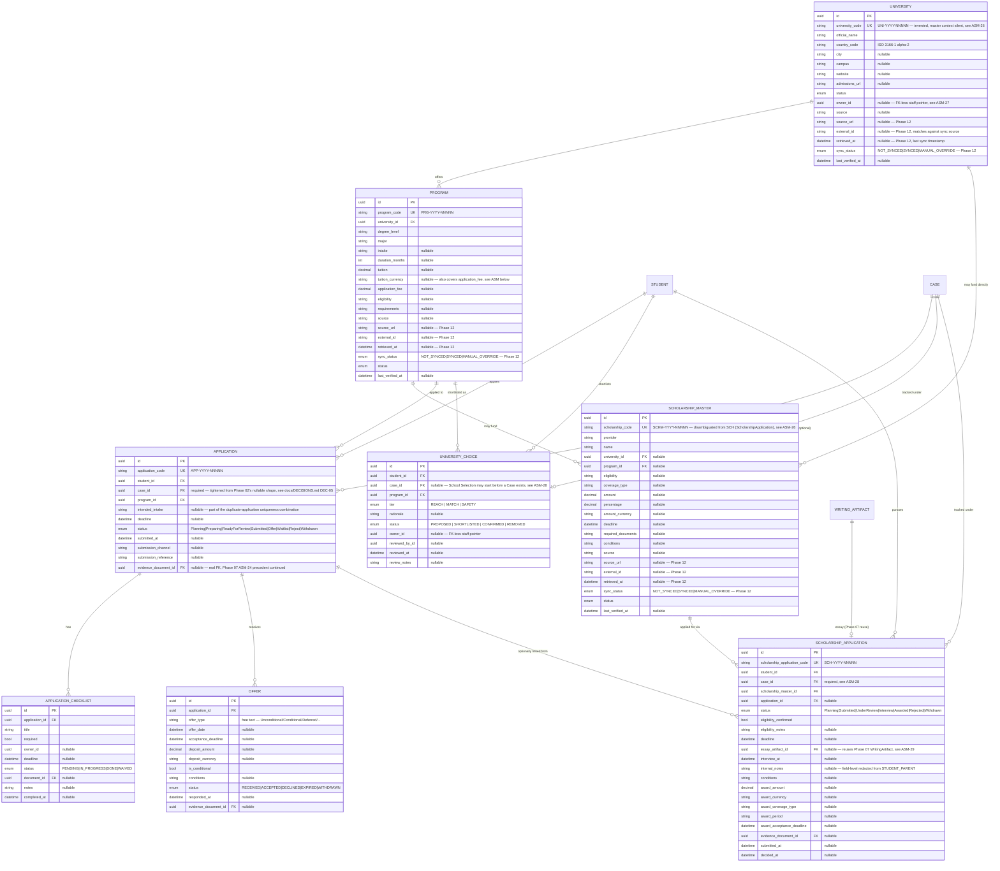

**Master data** (University/Program/ScholarshipMaster) is GLOBAL, permission-gated only —
no per-record scope, the same treatment as `ContractTemplate`/`TaskTemplate`
(`docs/security/RBAC_MATRIX.md` section 3). "Không duplicate University/Program/
ScholarshipMaster chỉ vì nhiều Application/Student/intake" — every transaction entity
above references these by FK only, never a copied name/tuition/amount; service-layer
duplicate checks (`DUPLICATE_UNIVERSITY`/`DUPLICATE_PROGRAM`/
`DUPLICATE_SCHOLARSHIP_MASTER`) additionally reject near-identical rows at create time.

**Phase 12** adds the external-data-sync columns (`sourceUrl`/`externalId`/`retrievedAt`/
`syncStatus`) 12-platform/02_INTEGRATIONS_JOBS.md names, completing `source`/
`lastVerifiedAt` (Phase 08). Only `UniversitiesService.syncExternal` was built (matched by
`externalId` only, never by name — a sync source row with no matching `externalId` is
skipped, never inserted, so "Không duplicate University" holds even under sync); Program/
ScholarshipMaster carry the same columns for schema consistency but have no sync method yet
(no concrete data source ever returns Program/ScholarshipMaster records — see
`docs/ASSUMPTIONS.md` ASM-51). A row is never silently overwritten once a staff member has
verified it more recently than the last sync (`lastVerifiedAt > retrievedAt`) — the sync
instead marks it `MANUAL_OVERRIDE` and skips.

**Application's duplicate-prevention** is service-layer, not a DB unique constraint —
Phase 02's original `@@unique([studentId, programId])` would have permanently blocked
legitimate reapplication; relaxed to a plain index + an "at most one non-terminal
Application per (student, program, intendedIntake)" check
(`ApplicationsService.assertNoActiveDuplicate`) — see `docs/DECISIONS.md` DEC-05. `OFFER`
status is reachable on the parent Application only by actually creating an Offer row
(`ApplicationsService.transitionToOffer`), never a bare status PATCH — "Không được chuyển
Offer nếu chưa có offer record tương ứng."

**Offer** supports multiple rows per Application (a renegotiated/revised offer is a new
row, never overwriting history); "current offer" is a computed read (most recent ACCEPTED,
else most recent non-expired RECEIVED), not a stored flag — same pattern as
`TasksService.isOverdue`. A RECEIVED offer past its `acceptanceDeadline` is lazily synced
to EXPIRED on read, mirroring `Payment.status`'s OVERDUE sweep.

**ScholarshipApplication** is kept fully separate from `ScholarshipMaster` (many
applications reference one master row, never copied) and deliberately carries no
FK/shared column with Contract/Payment/CommissionTransaction — award money is tracked
entirely on this row, never mixed with the agency's own commercial terms ("Không trộn
scholarship amount / student contract fee / tuition payment / partner commission"). AWARDED
and REJECTED are reachable only via their own dedicated actions, never a generic status
PATCH, since award carries required additional data.

See `docs/ASSUMPTIONS.md` ASM-26 through ASM-32 for the specific ambiguous-requirement
resolutions this phase recorded (business-ID formats, FK-less owner pointers, nullable vs.
required `caseId`, ApplicationChecklist/essay reuse instead of duplication, Task/
Notification trigger scoping, the RBAC grant matrix, and why catalog/third-party money
fields are not subject to Contract/Payment-style redaction).

## 6. Documents domain (schema since Phase 02; controller/service built Phase 07; real storage/scan/versioning Phase 12)

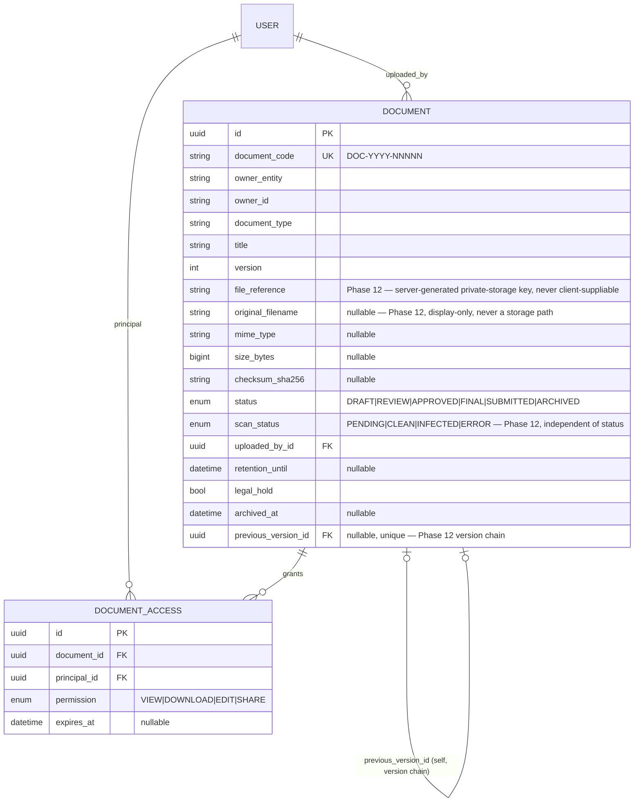

`ownerEntity` + `ownerId` is a deliberate loose polymorphic reference (not a DB FK) — a
Document can belong to any of Contract/Application/Visa/Assessment/etc. across domains
that don't exist as foundation tables yet. It is validated at the service layer, not the
DB layer, exactly like `Comment`/`Approval` below.

**Phase 07** built the module (`DocumentsService`/`DocumentsController`,
`POST /documents`, `GET /documents/:id`, `GET /documents/:id/download`) that this schema
had waited for since Phase 02. `create` auto-grants the uploader `VIEW`+`DOWNLOAD`;
`grantCaseAccess(documentId, caseId)` — called by every Phase 07 evidence/writing service
immediately after an `evidenceDocumentId`/`documentId` link is set — grants `VIEW`+
`DOWNLOAD` to every current `CaseMember` plus the linked student/parent portal users.
Access is a grant-based check (`DocumentAccess` row required, except GLOBAL-scope roles),
not a `ScopeKind` lookup — see `docs/security/RBAC_MATRIX.md` section 3 and
`docs/ASSUMPTIONS.md` ASM-23.

**Phase 08** continues the same pattern unchanged for four new evidence links —
`Application.evidenceDocumentId`, `ApplicationChecklist.documentId`,
`Offer.evidenceDocumentId`, `ScholarshipApplication.evidenceDocumentId` — every Admission
service that sets one of these calls the same `grantCaseAccess` immediately after, no new
Documents-side code needed.

**Phase 12** replaces the Phase 07 metadata-only upload with a real private-storage
pipeline (`StorageProvider`, default `LocalFilesystemStorageProvider` — a non-web-served
directory outside `dist/`, never registered as a static-file route). `POST /documents` is
now a real multipart upload: `fileReference` is server-generated (a `StorageProvider`-
issued key, never derived from or trusted from the client), `checksumSha256`/`mimeType`/
`sizeBytes` are computed from the actual bytes, and `originalFilename` (new column) is a
sanitized display-only name. `MalwareScanProvider` (default: detects the industry-standard
EICAR test signature) runs asynchronously via the new job queue (section 11) —
`scanStatus` starts `PENDING` and download is blocked until it reaches `CLEAN`. Download is
a two-step signed-URL flow (`SignedUrlService`, HMAC-SHA256, short TTL, scoped to one
document + one principal): `GET /documents/:id/download` authorizes and returns a
short-lived `downloadUrl`; the actual bytes are served by the separate, unauthenticated-but-
signature-verified `GET /documents/download/:token`. `EDIT`/`SHARE`/`ARCHIVE` (all three
already reserved in the Phase 02 `DocumentAccessPermission` enum) are now real actions;
`POST /documents/:id/versions` is the only way to replace a document's content — always a
brand-new row chained via `previousVersionId`, existing grants copied forward, never an
in-place overwrite ("Final/submitted/legal files require versioning"). See
`docs/ASSUMPTIONS.md` ASM-50.

## 7. Commercial domain (Phase 05)

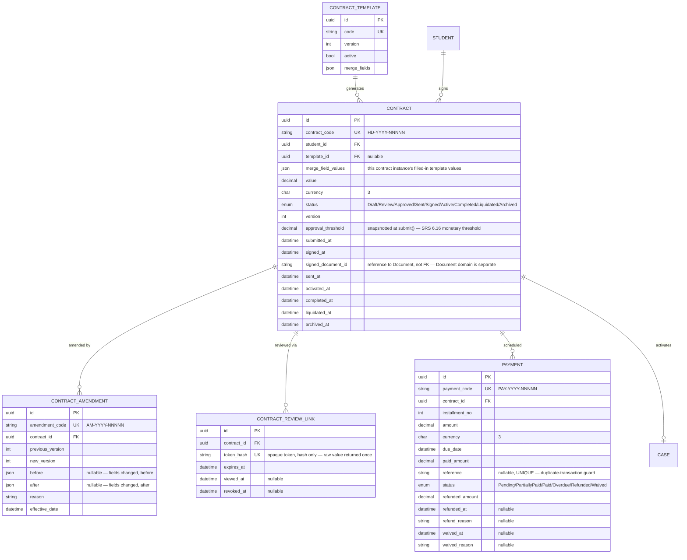

`(contractId, installmentNo)` is unique on `Payment`. A signed `Contract`'s legal artifact
(`signed_at`/`signed_document_id`) is never overwritten in place (Hard Rule #4) — live-term
changes after signing go through `ContractAmendment`. `Case.contractId` is set at
`sign()`, not at Contract creation (`docs/ASSUMPTIONS.md` ASM-15). Refund is recorded on
the same `Payment` row rather than a separate transaction table (`docs/ASSUMPTIONS.md`
ASM-14). `PaymentStatus.OVERDUE` is a real stored status, lazily synced from PENDING/
PARTIALLY_PAID on read — see `docs/database/DATA_DICTIONARY.md` section 4.15.

## 8. Partners domain (foundation slice, fully built out Phase 10 — 10-partners/01_PARTNER_CRM.md)

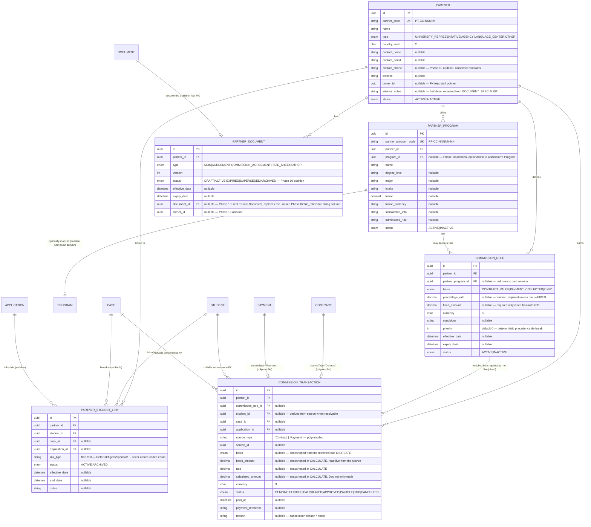

**Partner** is GLOBAL, permission-gated only (no per-record scope) — same treatment as
University/Program (`docs/security/RBAC_MATRIX.md` section 3). Duplicate prevention on
(name, countryCode), case-insensitive, `409 DUPLICATE_PARTNER` — "Không duplicate Partner
chỉ vì nhiều Program/Student/Application/Case/CommissionTransaction." Never referenced by
name as a foreign key anywhere; every child row below links via `partnerId`.

**PartnerProgram** always belongs to an existing Partner (nested creation route). Duplicate
prevention on (partnerId, name, degreeLevel, major, intake). `programId` is an OPTIONAL,
one-directional FK into the existing Admission-domain `Program` — set when a partner
program genuinely corresponds to a catalog row, left null when it's purely the partner's
own commercial mapping; never a duplicated University/Program row created in this module —
see `docs/ASSUMPTIONS.md` ASM-41.

**PartnerDocument** reuses the existing Document subsystem (`documentId` real FK, same
ASM-24 precedent as every Phase 07-09 evidence field) — no PartnerFile/PartnerStorage
model. Legal/commercial documents are immutable once ACTIVE ("Không overwrite signed/final
partner documents") — `update()` rejects any PATCH once status leaves DRAFT; a correction
creates a brand-new PartnerDocument row (`(partnerId, type, version)` unique, version
auto-incremented), and `activate()` atomically marks the prior ACTIVE row for the same
(partner, type) as SUPERSEDED. A DRAFT past no natural expiry stays DRAFT indefinitely; an
ACTIVE row past `expiryDate` is lazily synced to EXPIRED on read, the same sweep pattern as
`Offer.status`/`Payment.status`. See `docs/ASSUMPTIONS.md` ASM-42.

**PartnerStudentLink** is a pure junction table (SRS 6.17 "liên kết nhiều student/case/
application bằng bảng trung gian") — every FK is validated against its real owning table,
nothing is ever copied (no student/partner/application name stored on the row). "At most
one ACTIVE link per (partner, student, case, application) tuple" is a service-layer check,
not a DB constraint — archiving frees the combination for a fresh link. A Student may carry
links to many different Partners; a Partner may carry links to many
Students/Cases/Applications — never collapsed into a duplicate Case/Application entity.

**CommissionRule** is deliberately separate from `CommissionTransaction` (config vs. fact)
and carries no shared FK/column with `Payment`/`Contract.value`/
`ScholarshipApplication.awardAmount` anywhere (Hard Rule "Commission phải tách khỏi student
payment"). `basis` determines whether `percentageRate` (a fraction, e.g. 0.10 = 10%) or
`fixedAmount` applies — cross-validated server-side, never both/neither. When several
active rules could match the same transaction, precedence is deterministic: a
PartnerProgram-specific rule beats a partner-wide one, then higher `priority` wins, then
most-recently-created, then `id` — never random (`CommissionRulesService.selectRuleFor`).
See `docs/ASSUMPTIONS.md` ASM-44.

**CommissionTransaction** is the actual financial fact. `basis`/`currency` are snapshotted
from the matched CommissionRule at CREATE time; `basisAmount`/`rate`/`calculatedAmount` are
snapshotted at CALCULATE time, reading the live `Contract.value` or `Payment.paidAmount`
(never a duplicate outstanding/paid calculation — "dùng existing Payment source of truth").
All money math uses `Prisma.Decimal` arithmetic exclusively (`.times()`/
`.toDecimalPlaces(2, ROUND_HALF_UP)`), never a JS-float `Number()` round-trip. The FSM
(PENDING→ELIGIBLE→CALCULATED→APPROVED→PAYABLE→PAID, CANCELLED from any non-terminal state)
is taken verbatim from the orchestration prompt's own example status list — every forward
transition is its own dedicated, precondition-gated action, never a bare client-supplied
status. "No duplicate transaction for the same triggering event" is enforced at the service
layer on `(sourceType, sourceId, commissionRuleId)`, excluding CANCELLED rows. PAID and
CANCELLED are both hard-terminal — no adjustment/reversal mechanism exists (not named
anywhere in 10-partners/01_PARTNER_CRM.md); see `docs/ASSUMPTIONS.md` ASM-45.

See `docs/ASSUMPTIONS.md` ASM-40 through ASM-45 for the specific ambiguous-requirement
resolutions this phase recorded (contacts/business-ID formats, the PartnerProgram↔Program
FK design, the PartnerDocument rebuild, the RBAC/field-redaction matrix, CommissionRule
basis/precedence design, and the no-adjustment-mechanism decision).

## 9. Notifications domain

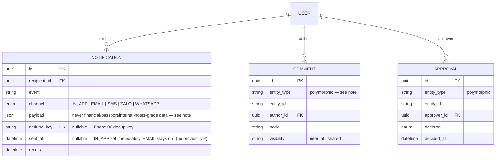

`Comment`/`Approval` use the same `entityType` + `entityId` polymorphic pattern as
`Document.ownerEntity/ownerId` — one shared model instead of a per-domain duplicate
(ARCH-DEC-04-equivalent reasoning), validated at the service layer.

`Notification.dedupe_key` (Phase 06) is `@unique`, same nullable-unique NULL-semantics
pattern as `Payment.reference`/`ContractReviewLink.token_hash` — a caller-supplied key
like `task-deadline:{taskId}:{offsetDays}:{channel}` makes re-firing the same logical
event a no-op (`NotificationsService.notify` catches the resulting unique-constraint
violation and returns `null` rather than erroring). `payload` is deliberately minimal per
event — e.g. `CONTRACT_APPROVAL_REQUEST` carries `contractId`/`contractCode`/`studentId`
but never `value`/`currency`; `PAYMENT_OVERDUE_REMINDER` carries `paymentId`/`dueDate` but
never `amount` — SRS 6.20 "Không đưa dữ liệu nhạy cảm trực tiếp vào notification body." No
queue/scheduler dispatches these yet — see `docs/ASSUMPTIONS.md` ASM-18.

## 10. Identity domain, extended (Phase 03A/B — Auth + RBAC scope links; Phase 11 — Parent invitation)

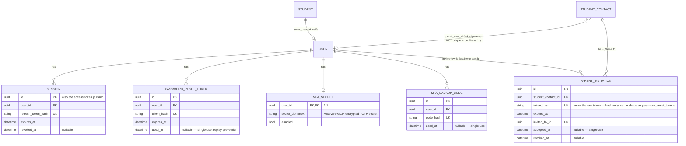

`users.locked_until` (brute-force lockout) and `audit_logs.metadata` (JSONB — SRS 6.21
export reason/filter/row-count/fields) are column additions on existing Phase 02 tables,
not new tables — see `docs/database/DATA_DICTIONARY.md` section 4.20.

`Student.portalUserId` (nullable, unique) and `StudentContact.portalUserId` (nullable, NOT
unique — see below) are what `ScopePolicyService` (`docs/security/RBAC_MATRIX.md`)
evaluates for the OWN_STUDENT scope kind — see `docs/ASSUMPTIONS.md` ASM-05 for why they
exist.

**Phase 11 — Student/Parent Portal**: `StudentContact.portalUserId`'s original Phase 03
`@unique` constraint was relaxed to a plain index (`docs/DECISIONS.md` DEC-06) — one Parent
`User` commonly links to more than one `StudentContact` row (multiple children), which the
unique constraint made structurally impossible. Every `ScopePolicyService` OWN_STUDENT check
that resolves a linked-parent additionally requires `portalStatus = 'ACTIVE'` (not merely a
non-null `portalUserId`) — access from a `REVOKED` or still-`INVITED` contact is denied on
the very next request, no caching. `ParentInvitation` is a new, narrowly-scoped token table
(never a parallel auth system) — one row per invite attempt, so re-inviting after an
expiry/revoke has its own history rather than overwriting a single mutable field set.
"Verification" is token possession, the same standard `password_reset_tokens` already
established in Phase 03. No new `StudentPortalProfile`/`ParentApplication`/parallel Student
or Parent entity was created — Portal is a read/action layer over the existing
Student/Case/Task/Document/Application/... domains, gated by this relationship plus the new
`portal:access` permission (`docs/security/RBAC_MATRIX.md`). See `docs/ASSUMPTIONS.md`
ASM-46 through ASM-49.

## 11. Cross-cutting infra (not business entities)

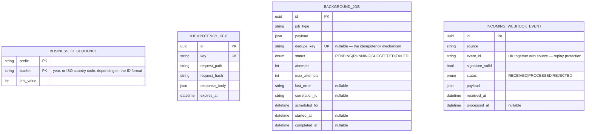

See `docs/database/DATA_DICTIONARY.md` "Additions beyond the required list" for why these
exist and why they are deliberately kept out of the 40-entity business model.

**Phase 12** (12-platform/02_INTEGRATIONS_JOBS.md) adds `BackgroundJob` — the DB-backed
queue behind document scanning, reminder-sweep scheduling, and email dispatch (`JobsService`
enqueues idempotently on `dedupeKey`; `JobRunnerService` polls, dispatches to a registered
per-`jobType` handler, and retries `TransientJobError`s with exponential backoff, capping at
`maxAttempts` before marking `FAILED` — see `docs/ASSUMPTIONS.md` ASM-52) — and
`IncomingWebhookEvent` — a generic, reusable webhook-receipt log; `(source, eventId)`
uniqueness is the idempotency/replay-protection mechanism, checked before any business-data
mutation is attempted (`docs/ASSUMPTIONS.md` ASM-53). Both are process infrastructure, not
business entities, same reasoning as `BusinessIdSequence`/`IdempotencyKey` above.

## 12. Visa domain (Phase 09 — 09-visa/*.md)

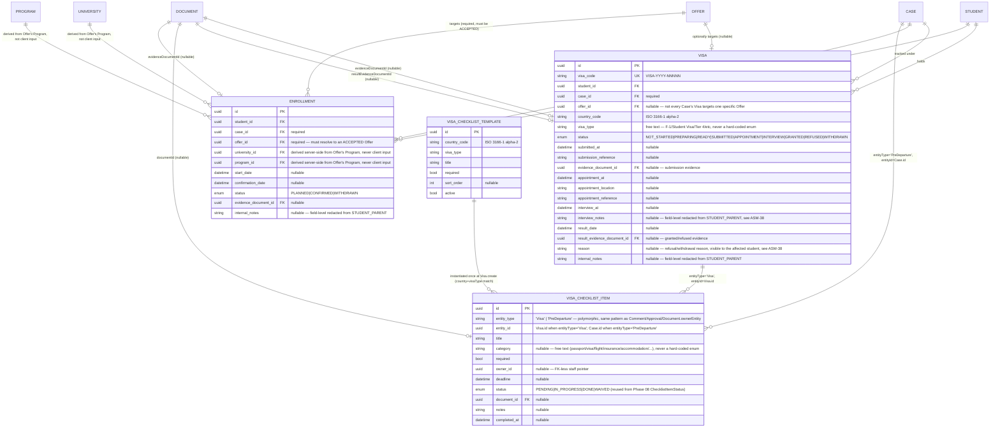

**Visa** links to Student/Case directly (never creating a new Student/Case) and optionally
to a specific Offer when the Case's workflow already produced one; "at most one
non-terminal Visa per Case" is a service-layer check
(`VisasService.assertNoActiveDuplicate`, mirroring Application's DEC-05 pattern), not a DB
unique constraint — reapplying after WITHDRAWN/REFUSED creates a new row, preserving full
history. The FSM (`NOT_STARTED -> PREPARING -> READY -> SUBMITTED -> APPOINTMENT ->
INTERVIEW -> GRANTED/REFUSED`, plus `WITHDRAWN` from any non-terminal state) is enforced
entirely server-side with dedicated actions for SUBMITTED/APPOINTMENT/INTERVIEW/GRANTED/
REFUSED — never a bare status PATCH, same discipline as Application/Offer in Phase 08.
READY requires every `required=true` `VisaChecklistItem` under `entityType='Visa'` to be
DONE or WAIVED first.

**VisaChecklistTemplate** is GLOBAL master/config data keyed by `(countryCode, visaType,
title)`, the same treatment as `TaskTemplate`/`ContractTemplate` — checklist content is
never hard-coded in application logic. `VisasService.create` instantiates matching active
templates into real `VisaChecklistItem` rows exactly once, at Visa creation time; templates
are never re-instantiated on read or edit.

**VisaChecklistItem** is deliberately ONE shared polymorphic entity for two Phase 09
consumers (Visa-scoped items and Case-level Pre-Departure items) rather than two near-
duplicate tables — see `docs/ASSUMPTIONS.md` ASM-33 for why this was judged safe to
introduce as new shared structure while Phase 08's already-PASSed `ApplicationChecklist`
was deliberately left untouched, not retroactively generalized into the same model.
Pre-Departure items use `entityId = Case.id` (not `Visa.id`) because pre-departure
readiness is a Case-level milestone that outlives any single Visa attempt.

**Enrollment** is a Student/Case *transaction*, not master data — it references
University/Program by FK only (server-derived from the target Offer's Program, never
accepted from the client, and never copying name/tuition). Creating an Enrollment requires
the target Offer to belong to the same Case and be in `ACCEPTED` status
(`INVALID_ENROLLMENT_TARGET` otherwise — rejects DECLINED/EXPIRED/WITHDRAWN/RECEIVED
offers and offers from other Cases). "At most one CONFIRMED Enrollment per Case" is a
service-layer check (`EnrollmentsService.assertNoActiveConfirmed`); multiple `PLANNED`
attempts and a full WITHDRAWN history are allowed, matching the Phase 09 instruction's
explicit "cần thiết kế lịch sử nếu cho phép nhiều lần nhập học" requirement.

**Closure** (`CasesService.close`, Phase 04's existing Case FSM, extended not duplicated)
gates on four new Phase 09 preconditions in addition to Phase 04's existing open-task
check: outstanding Contract/Payment debt (`PaymentsService.hasOutstandingDebtForCase`,
unconditional), any non-terminal Visa (`VisaStatusService.hasOpenVisa`, unconditional), an
unconfirmed Enrollment when at least one Application exists for the Case
(`VisaStatusService.hasUnconfirmedRequiredEnrollment`, conditional), and an incomplete
Pre-Departure checklist when at least one item exists
(`VisaStatusService.hasIncompletePreDepartureChecklist`, conditional) — see
`docs/ASSUMPTIONS.md` ASM-36 for why the last two are conditional rather than
unconditional. All four checks reuse existing Phase 04/05 services; no duplicate debt
calculation or second Case FSM was introduced.

See `docs/ASSUMPTIONS.md` ASM-33 through ASM-39 for the specific ambiguous-requirement
resolutions this phase recorded (Enrollment as its own entity, the shared
VisaChecklistItem design, the RBAC grant matrix, field-level redaction scope, and the
closure-precondition conditionality reasoning).
